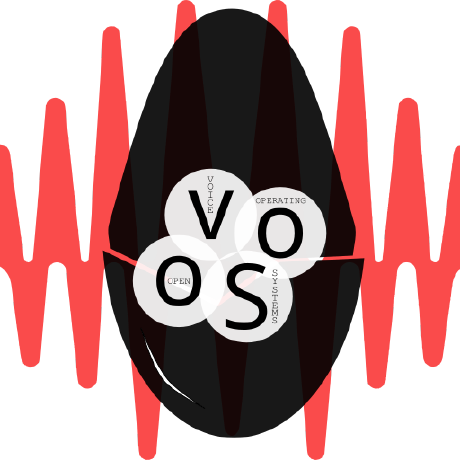

# ha-ovos-integration

> 🚧 **Work in progress — v0.0.2, first real install confirmed working, with one bug already
> caught and fixed.** Config flow pre-fill, initial writes, and all three entity platforms
> verified end-to-end on real Home Assistant Core. v0.0.1 had a restart-persistence bug
> (entities re-initialized from the original config-flow submission instead of the current
> shared file) — fixed in v0.0.2, not yet re-verified across an actual restart.

A Home Assistant **integration** (HACS-distributed `custom_component`, not a Supervisor
add-on) for configuring OVOS the way HAOS users already configure everything else: as
entities under Settings → Devices & services, not raw JSON fields or a bespoke webpage.

Two things it aims to do:

1. **Shared OVOS configuration** (language, location, units) — v1, implemented: reads/writes
   `/share/mycroft/mycroft.conf` directly (plain JSON, not `ovos-config` yet — see
   `DEVELOPER.md`), pre-filled from `hass.config` where possible, exposed as `text`/`number`/
   `select` entities.
2. **Per-skill settings** — not started. Would read installed skills' `settingsmeta.json`
   (OVOS's own existing convention for describing configurable skill settings) and generate
   matching HA entities automatically, instead of a separate skill-config UI.

See [DEVELOPER.md](DEVELOPER.md) for the architecture, open questions, and how this relates
to the other HA-OVOS repos.

## About

Part of the **HA-OVOS** project: making it easy for a Home Assistant OS user to discover and
use OpenVoiceOS, through interfaces that feel native to HAOS. See
[haos-ovos-addons](https://github.com/andlo/haos-ovos-addons) for the Supervisor add-ons and
[ovos-skill-browser](https://github.com/andlo/ovos-skill-browser) for the web-based skill
store.

## License

Licensed under the [Apache License 2.0](LICENSE), matching OpenVoiceOS's own project license.

The OpenVoiceOS logo is used with attribution to the [OpenVoiceOS project](https://openvoiceos.org); this project is not officially affiliated with or endorsed by OpenVoiceOS.
